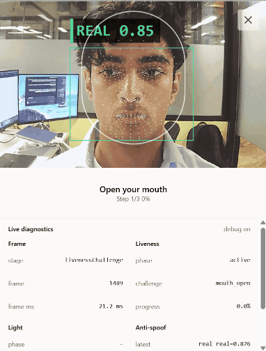

# Web Verify Library

[](https://github.com/abhigyaan-jha/web-verify/blob/main/package.json)
[](https://github.com/abhigyaan-jha/web-verify/actions/workflows/ci.yml)
[](https://github.com/abhigyaan-jha/web-verify/commits/main)
[](LICENSE)

Browser face readiness, movement liveness, screen light response, spoof scoring,
ONNX model loading, and local verification flow orchestration.

`web-verify` is a small TypeScript browser library and OSS verification toolkit.
It exposes a simple client API for application code, a managed session facade for
verification flows, and lower-level modules for apps that need direct access to
face, liveness, light, spoof, ONNX, capture, draw, runtime, or actor
orchestration primitives.

## Highlights

- Browser-first `HTMLVideoElement` processing
- Simple unified client API with `createWebVerifyClient()`
- XState-backed managed flow for camera, model loading, face readiness, liveness, light, completion, failure, and cancellation
- Deep modules for focused use: `face`, `liveness`, `light`, `spoof`, `onnx`, `capture`, `draw`, `models`, `runtime`
- ONNX Runtime Web adapters and model manifest loading
- Sequence helpers for randomized or repeated liveness and light challenges
- Canonical `VerificationError` handling across runtime, models, checks, and sessions
- Optional diagnostics snapshots and drawing overlay for debug frames and landmarks
- No hosted-product workflow or identity workflow assumptions

## Compatibility

Browser:

- Desktop and mobile browsers with camera access
- ESM bundlers such as Vite, Bun, and modern npm-based toolchains
- `onnxruntime-web` for browser model execution
- `HTMLVideoElement` input from camera streams or compatible browser media sources
- OpenCV worker assets for light response checks

Package:

- TypeScript source and bundled TypeDefs
- Browser ESM package output in `dist/`
- Runtime assets served from copied static `models/` and `vendor/opencv/` package folders

## Quick Start

Install once the package is published:

```sh
bun add web-verify
npm install web-verify
```

Create a client and run a verification session:

```ts
import { createWebVerifyClient } from 'web-verify';

const verifier = createWebVerifyClient();

const result = await verifier.start({
  video,
  checks: {
    face: true,
    liveness: true,
    light: true,
    spoof: true,
  },
  models: {
    manifestUrl: '/web-verify/models/manifest.json',
  },
});
```

The application provides the video element. `web-verify` loads browser models,
runs the enabled checks, and returns a typed `VerificationResult`.

## Code Examples

Use generated challenge sequences:

```ts
import {
  createLightSequence,
  createLivenessSequence,
  createWebVerifyClient,
} from 'web-verify';

const verifier = createWebVerifyClient();

const result = await verifier.start({
  video,
  checks: ['face', 'liveness', 'light', 'spoof'],
  liveness: {
    challenges: createLivenessSequence({ length: 3 }),
  },
  light: {
    sequence: createLightSequence({ length: 4 }),
    opencvAssetBaseUrl: '/web-verify/vendor/opencv/',
  },
  models: {
    manifestUrl: '/web-verify/models/manifest.json',
  },
});
```

Subscribe to live session snapshots:

```ts
import { createWebVerifyClient } from 'web-verify';

const verifier = createWebVerifyClient();

const result = await verifier.start({
  video,
  debug: true,
  checks: {
    face: true,
    liveness: true,
    light: true,
    spoof: true,
  },
  models: {
    manifestUrl: '/web-verify/models/manifest.json',
  },
  onSnapshot: (snapshot) => {
    console.log(snapshot.stage, snapshot.instruction);
  },
});
```

Handle canonical errors:

```ts
import { createWebVerifyClient, isVerificationError } from 'web-verify';

try {
  const verifier = createWebVerifyClient();
  await verifier.start({ video, models: { manifestUrl: '/web-verify/models/manifest.json' } });
} catch (error) {
  if (isVerificationError(error)) {
    console.error(error.code, error.area, error.recoverable);
  }
}
```

Draw diagnostics landmarks and detection boxes:

```ts
import { createWebVerifyClient } from 'web-verify';
import { mountDiagnosticsOverlay } from 'web-verify/draw';

const verifier = createWebVerifyClient();
const verification = verifier.start({
  video,
  debug: true,
  models: { manifestUrl: '/web-verify/models/manifest.json' },
});

const cleanup = verifier.activeSession
  ? mountDiagnosticsOverlay(verifier.activeSession, overlayElement, {
      fit: 'cover',
      mirrored: true,
    })
  : null;

const result = await verification;
cleanup?.();
```

## Results

`VerificationResult` is exported from the package. Import the canonical type
instead of recreating the shape in app or demo code:

```ts
import type { VerificationResult } from 'web-verify';

const result: VerificationResult = await verifier.verify(video);
```

Face output includes detector score, mesh landmarks, fit checks, and stability.
Liveness output includes the requested sequence, completed challenges, records,
and motion telemetry. Light output includes baseline sampling, per-color steps,
sequence score, correlation, and response magnitude. Spoof output summarizes
sample counts, model count, real frame ratio, and median scores.

## Deep Entrypoints

The root package exports the app-facing client, configuration, errors, sequence
helpers, and shared result types. Focused modules are also available for custom
demos, instrumentation, direct runtime use, and advanced orchestration:

- `web-verify/capture`: camera, media, frame, and geometry helpers
- `web-verify/draw`: diagnostics overlay drawing
- `web-verify/face`: detector, mesh, fit, guide geometry, and stability helpers
- `web-verify/flow`: managed verification session plus advanced XState machine utilities for custom actor orchestration and testing
- `web-verify/light`: light response pipeline and sequence helpers
- `web-verify/liveness`: movement challenge controller and sequence helpers
- `web-verify/models`: manifest parsing, model resolution, and runtime loading
- `web-verify/onnx`: ONNX adapter helpers
- `web-verify/runtime`: low-level runtime barrel
- `web-verify/spoof`: spoof score fusion and summary helpers

Application developers should normally start with `createWebVerifyClient()`.
Use `createVerificationSession()` when you want direct control over a single
verification run. Deep modules are intentional toolkit surfaces for custom demos,
instrumentation, direct runtime use, and advanced integrations.

## Demos



Run the local browser demo:

```sh
bun install
bun run demo
```

Open:

```txt
http://127.0.0.1:5173/
```

The demo shows camera flow, live status, debug diagnostics, and local module
results from face, liveness, light, and spoof checks.

## Models

Default browser assets are static package files, not JavaScript bundle imports.
Serve or copy the package `models/` and `vendor/opencv/` folders under
`/web-verify/`:

```ts
const verifier = createWebVerifyClient({
  models: {
    baseUrl: '/web-verify/models/',
    manifestUrl: '/web-verify/models/manifest.json',
  },
});
```

The default manifest uses relative model filenames, which resolve from
`models.baseUrl` or from the manifest URL directory. Light checks load OpenCV
from `/web-verify/vendor/opencv/` by default. ONNX Runtime wasm defaults to a
version-pinned jsDelivr URL and can be overridden with `models.onnxWasmBaseUrl`.
See `models/README.md` for manifest details.

## Project Structure

```txt
src/web-verify.ts  public client facade
src/config.ts      configuration and option contracts
src/result.ts      public result contracts
src/events.ts      session event and snapshot contracts
src/runtime.ts     low-level runtime exports
src/models.ts      model manifest, adapters, and runtime contracts
src/capture/       camera, media, frame, and display geometry helpers
src/draw/          diagnostics overlay drawing
src/face/          detector, mesh, fit, stability, and guide geometry
src/flow/          XState-backed managed session and advanced machine utilities
src/light/         light response pipeline and sequence helpers
src/liveness/      movement challenge controller and sequence helpers
src/onnx/          ONNX Runtime Web adapters
src/spoof/         spoof scoring and summary pipeline
models/            default browser-loadable ONNX model manifest and assets
vendor/opencv/     OpenCV worker assets used by light checks
demo/browser/      browser demo application
```

## Development

```sh
bun install
bun test
bun run typecheck
bun run build
bun run package:audit
bun run demo
```

Build output is generated by TypeScript into a freshly cleaned `dist/`.

## Notes

`web-verify` is not a hosted verification product. It does not define a backend
protocol, app policy layer, API client, or identity workflow. It is a browser
library for local face readiness, movement liveness, light response, spoof
scoring, runtime loading, and session orchestration.

## License

MIT

Bundled models and OpenCV runtime assets retain their upstream licenses. See
`THIRD_PARTY_NOTICES.md` for npm package attribution and license details.
