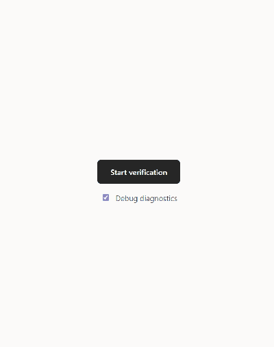
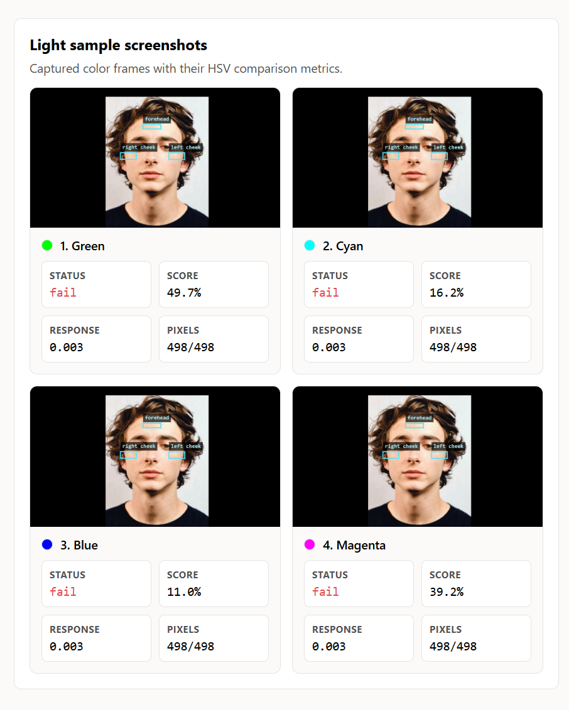

# OpenFace Liveness

[](https://github.com/abhigyaan-jha/open-face-liveness/blob/main/package.json)
[](https://github.com/abhigyaan-jha/open-face-liveness/actions/workflows/ci.yml)
[](https://github.com/abhigyaan-jha/open-face-liveness/commits/main)
[](LICENSE)

`open-face-liveness` is a browser library for local face-liveness,
anti-spoofing, and light-response signals.

It runs verification signals locally from an `HTMLVideoElement` using
browser-loadable TensorFlow.js models, giving web apps fast face/liveness checks without
streaming every video frame to a server.

Use it before ID uploads, sensitive account actions, backend risk checks, or
manual review. It is not a standalone KYC or regulated identity-proofing system.

[Try the demo](https://abhigyaan-jha.github.io/open-face-liveness/)

## Highlights

- Browser TensorFlow.js stack: MediaPipe BlazeFace short-range detector, 478-landmark
  Face Mesh, Blendshape V2 expressions, and MiniFASNet V1SE/V2 spoof classifiers
- Face geometry: OneEuro smoothing, weighted Procrustes alignment,
  yaw/pitch/roll pose, fit boxes, and stable anchors
- Liveness challenges: head pan, head pitch, mouth-open, neutral-pose capture,
  dwell timers, hysteresis, recentering, and telemetry
- Passive RGB anti-spoofing: multi-model MiniFASNet fusion for
  screen-replay and presentation attack, with Fourier-spectrum supervision upstream
- Active screen-light checks: landmark skin regions, HSV color sampling,
  sequence correlation, and response magnitude
- XState verification flow: camera, models, face acquisition, stabilization,
  liveness, light challenge, completion, and failure

Ready to wire it up? [Jump to Quick Start](#quick-start).

## Accessibility Warning

The optional light challenge changes screen colors and may flash bright light.
Applications using it should warn users first, avoid it for people with
photosensitive epilepsy, migraine, or similar concerns,
and provide a non-light verification path when appropriate.


## Demos



Run the local browser demo:

```sh
bun install
bun run demo
```

Open:

```txt
http://127.0.0.1:5173/
```

The demo shows camera flow, live status, debug diagnostics, and local module
results from face, liveness, light, and spoof checks.

## Quick Start

Install once the package is published:

```sh
bun add open-face-liveness
npm install open-face-liveness
```

Create a client and run a verification session:

```ts
import { createOpenFaceLivenessClient } from 'open-face-liveness';

const verifier = createOpenFaceLivenessClient();

const result = await verifier.start({
  video,
  checks: {
    face: true,
    liveness: true,
    light: true,
    spoof: true,
  },
});
```

The application provides the video element. `open-face-liveness` loads browser models,
runs the enabled checks, and returns a typed `VerificationResult`.

### Models and wasm files

With Vite, webpack 5, Rspack, Parcel, or Next.js there is nothing to configure.
The package refers to its models and TensorFlow.js wasm files with `new URL(..., import.meta.url)`, so your bundler copies them into your build with content-hashed names.
They are served from your own origin and downloaded only when a verification starts, and the spoof models only when the spoof check is enabled.
Verification makes no third-party network requests.

Without one of those bundlers, for example with esbuild or a plain `<script type="module">`, copy the files into a directory your app serves and point the client at it:

```sh
npx open-face-liveness init public/open-face-liveness
```

```ts
const verifier = createOpenFaceLivenessClient({
  models: { assetBaseUrl: '/open-face-liveness/' },
});
```

Add the same `init` command to your `postinstall` script so the copy stays in sync when you upgrade.
A stale copy fails to load with the `models.integrity_failed` error code rather than running mismatched models.

`assetBaseUrl` can also point at a CDN mirror of the published package, such as `https://cdn.jsdelivr.net/npm/open-face-liveness@<version>/`.
Every file is still checked against the SHA-256 hashes built into the package.

## Results

`VerificationResult` is exported from the package. Import the canonical type
instead of recreating the shape in app or demo code:

```ts
import type { VerificationResult } from 'open-face-liveness';

const result: VerificationResult = await verifier.verify(video);
```

Face output includes detector score, mesh landmarks, fit checks, and stability.
Liveness output includes the requested sequence, completed challenges, records,
and motion telemetry. Light output includes baseline sampling, per-color steps,
sequence score, correlation, and response magnitude. Spoof output summarizes
sample counts, model count, real frame ratio, and median scores.



## Learn More

- [Model capabilities and sources](./models/README.md)
- [Runtime dependencies, assets, and package notes](./src/runtime/README.md)
- [Face geometry, landmark smoothing, fit, anchor, and liveness math](./src/face/README.md)
- [Diagnostics overlay legend](./src/draw/README.md)
- [Third-party model and runtime notices](./THIRD_PARTY_NOTICES.md)

## License

MIT

Bundled models and TensorFlow.js runtime assets retain their upstream licenses. See
`THIRD_PARTY_NOTICES.md` for npm package attribution and license details.
